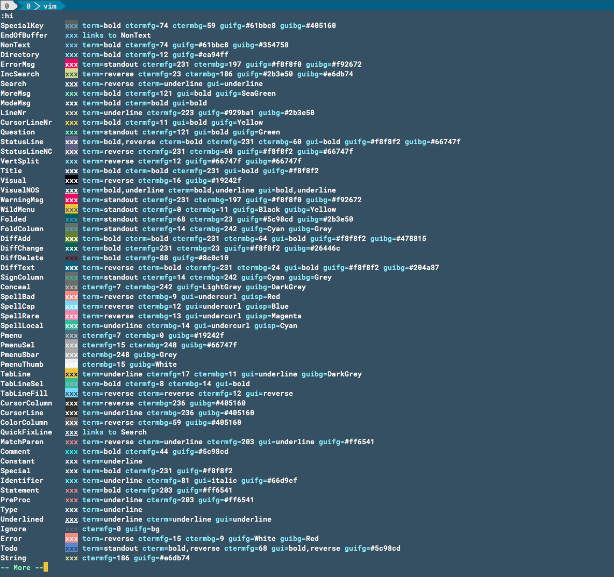

# tl;dr

1. You can check color by ```:hi```
1. Change colors in your ```.vimrc```

```vim
" Reset the background color in Normal mode so vim uses Terminal.app's background color"
highlight Normal ctermbg=none
" Reset the background color in Non Text area so vim uses Terminal.app's background color"
highlight NonText ctermbg=none
```

# Problem

I found a cool vim color schemes but I did not fully get satisfied with colors.<br>
But I am too lazy to build my own scheme.😣

Or sometimes, I found a scheme but it did not match with my Terminal background color.

# Solution

# Reveal your un-satisfaction
Open your vim and type ```:hi```
You can see a list of syntax highliting. All you have to do is find the part you want to change and keep the name such as _Visual_.We will use them later.
If you do ```:hi``` in vim, you shoudl get something like this.


## Change the color
Now that you know what you change, let's tweak the vim scheme

You can write the changes in your ```.vimrc```<br>

Let's take a look at my ```.vimrc```<br>

```vim
" Change the text color of Dictionary
highlight Directory ctermfg=blue
" Change the color of string when vertical split view is used
" Here I change the background color to none, which resets to the default"
" also, change the text color to blue"
highlight VertSplit ctermbg=none ctermfg=blue
```

## There is only few things that you have to know <br>
* ```ctermfg``` : Stands for color terminal foreground, which means text color
*  ```ctermbf``` : Stands for color terminal background
* If you want to reset the color use ```none```. This is very useful when you are trying to match your vim background color and termianl color

* Just add below to your ```.vimrc``` and you can match your vim color to your terminal color

```vim
" Reset the background color in Normal mode so vim uses Terminal.app's background color"
highlight Normal ctermbg=none
" Reset the background color in Non Text area so vim uses Terminal.app's background color"
highlight NonText ctermbg=none
```
